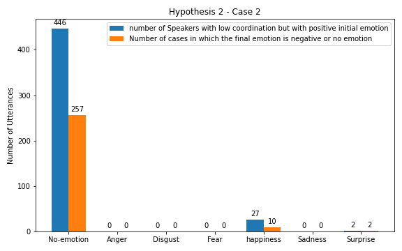
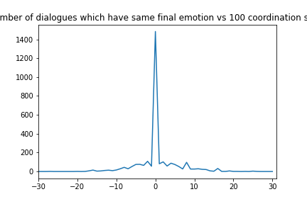
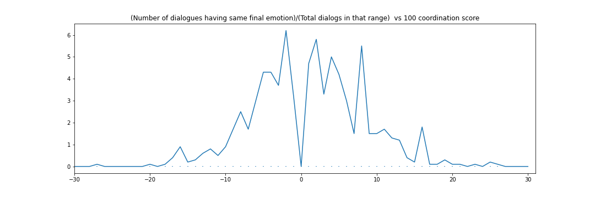
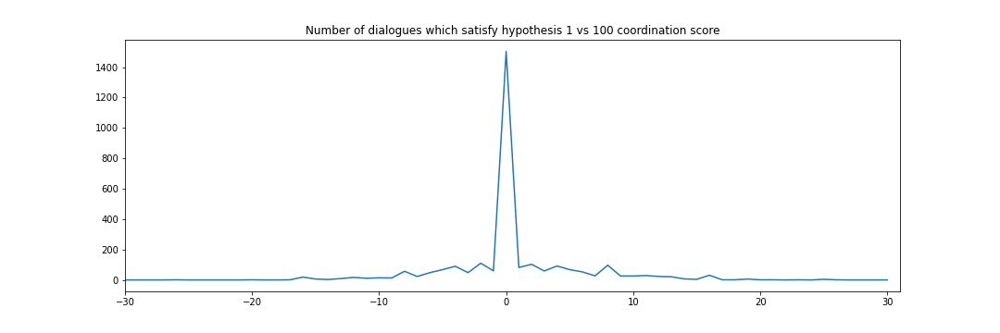
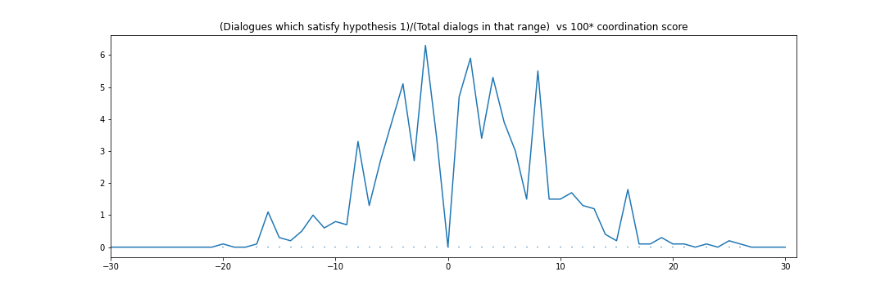
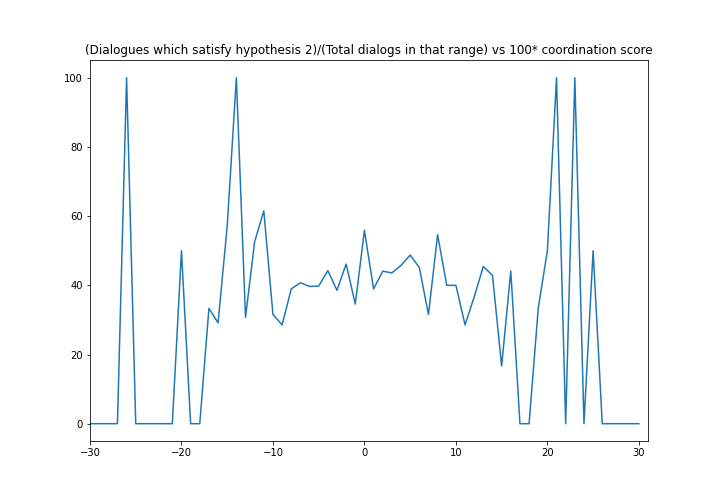

# Coordination
I have completed analysing hypothesis 1 and 2 and have found them accurate upto 40 and 57 percent till now. 
I however still have to plot the graphs and consider the cases of no emotion and will do them till tomorrow
# Theory
**Hypothesis 1**- When coordination is high (coordiantion>0.1) between the two speakers, eventually the replies have similar emotions.
I tested my hypothesis using the following 4 cases:

Case 1- The initial emotions of both the speakers are different and we find out how many of them turn out to be same after the conversation.

Case 2- The initial emotions of both the speakers are same and we find out how many of them turn out to be same after the conversation.

Case 3- The initial emotions of both the speakers are different and we find out how many of them turn out to be similar after the conversation.

Case 4- The initial emotions of both the speakers are same and we find out how many of them turn out to be similar after the conversation.

Here, negative emotions like angry, disgust, fear and sadness are similar emotions. We do not have any Similar emotions to Happiness or surprise.

**Hypothesis 2**- When coordination is low between the two speakers (coordinaiton<-0.1), the reply eventually has a negative emotion or no emotion. I again tested this hypothesis by considering the following 2 cases:

Case 1- The initial emotions of both the speakers do not matter and only the final emotion of both the speakers have to negative or of no emotion.

Case 2- The initail emotion of both the speakers is to be positive but the final emotions of botht the speakers should be negative or no emotion.

# Results
**Hypothesis 1**-

Case 1- 40% of the speakers had the same emotion after the conversation.

Case 2- 66.05% of the speakers had the same emotion after these conversations.

Case 3- 40% of the speakers had the similar emotion after the conversation.

Case 4- 66.05% of the speakers had the similar emotion after these conversations.

We practically saw that the results of Case 1 and Case 3 and the results of Case 2 and Case 4 are exactly the same and thus we can say that here we see no outputs which are similar but all are same.

**Hypothesis 2**-

Case 1- Even If the coordination of any one of the speakers is less than -0.1, the final emotion of both the speakers at the end of the conversation is negative or no emotion in 57.06% of the cases.

Case 2- Even if both the speakers have a positive emotion at the starting of the conversation, 56.63% times we can see that the eventual emotions turn out to be negative or no emotion.

I think by we got a good amount of cases which satisfy hypothesis 2

I also plotted the results of all my cases. In each plot the x-axis is the initial emotion of the speaker a or b respectively and y axis has the number of cases. The Blue Bars represent the amount which satify the input condition of the particular case and Orange bars represent the number of which have also cleared the condition on the final emotions.
We see that majority of the observations come from the 'no emotion' section. 

# The No Emotion Problem
I was wondering if we could consider finding the percentages without considering the initial emotion to be no emotion.
From this I found out: 

**Hypothesis 1**- 

Case 1- 25.53% (from 12 utterances)

Case 3- 25.53% (from 12 utterances)

**Hypothesis 2**-

Case 1- 40.54%

Case 2- 75%

# New approach
First we split the individual dialogs into multiple dialogs if the following condition is satisfied:

$$emotion_{i-2} != emotion_{i} {\ \  } and {\ \ }emotion_{i}=emotion_{i-1}$$...(1)

This gives us many more dialoges to use in the coordination function.

# Results

**Hypothesis 1**

Case 1-  61.16% of the conversations have same final emotion in the whole dataset

What I think that these graphs represent:-
These graphs represent the number of dialogs which satisfy the hypothesis in the new dataset. What I think they actually show is that they arrange the dialogues according to the coordination scores and the count their numbers according to the hypothesis. Since we have split the dataset according to the equation(1), the readings of the graphs comes out to be the number of dialogues arranged according to their coordination scores.

Case 2- 61.32% of the conversations have similar final emotions in the whole dataset

**Hypothesis 2**

Case 1- 39.79% of the conversations have negative or no final emotion in the whole dataset

